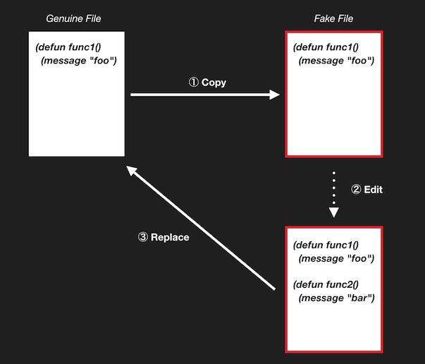

# Faker

Genuine to Fake, Fake to Genuine.

## What's this?

You can create *fake file*, which is the copy of the current *genuine file*.

And you can replace the *geinuine file* to the *fake file* after editing the *fake file*.



## Setup

```el
;; write the code as bellow in your init.el
(add-to-list 'load-path "/path/to/faker")
(setq faker-directory "/path/to/fake/file/save/dir/") ;; it should be absolute path
(require 'faker)
```

## Usage

You can execute commands bellow.

### faker

+ Create *fake file* in faker-directory if the current file is genuine.
+ Create *genuine file* if the current file is fake.

### cycle-fake-genuine

Switch genuine to fake, fake to genuine.
